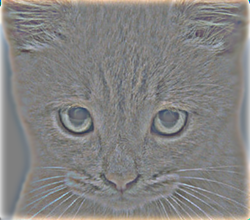
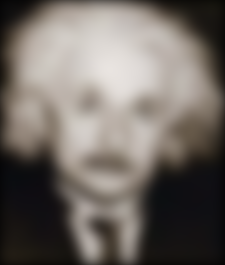

Look at image on right from very close, then from far away.

# Project 1: Image Filtering and Hybrid Images

## Update
* Add the report template (index.md) to the 'results' folder.

## Brief
* Due: Oct. 12
* Required files: `results/index.md` and `code/*`

## Overview

The goal of this assignment is to write an image filtering function and use it to create [hybrid images](http://cvcl.mit.edu/hybridimage/) using a simplified version of the SIGGRAPH 2006 [paper](http://cvcl.mit.edu/publications/OlivaTorralb_Hybrid_Siggraph06.pdf) by Oliva, Torralba, and Schyns.

*Hybrid images* are static images that change in interpretation as a function of the viewing distance.
The basic idea is that high frequency tends to dominate perception when it is available, but, at a distance, only the low frequency (smooth) part of the signal can be seen. By blending the high frequency portion of one image with the low-frequency portion of another, you get a hybrid image that leads to different interpretations at different distances.

## Details

This project is intended to familiarize you with Python and image filtering. Once you have created an image filtering function, it is relatively straightforward to construct hybrid images. If you don't already know Python, you will find this [tutorial on Python](https://www.python.org/about/gettingstarted/) helpful.

* Prerequired packages: [Anaconda python 3.6](https://www.anaconda.com/download/)

**Image Filtering:** Image Filtering(or convolution) is a fundamental image processing tool. See chapter 3.2 of Szeliski and the lecture materials to learn about image filtering (specifically linear filtering). Python has numerous **3rd party** and efficient functions to perform image filtering, but you will be writing your own such function from scratch for this assignment. More specifically, you will implement `my_imfilter()` which imitates the default behavior of the build in `scipy.misc.imfilter` function. As specified in `my_imfilter.py`, your filtering algorithm must 

   1. **support grayscale and color images**
   2. **support arbitrary shaped filters, as long as both dimensions are odd (e.g., 7x9 filters but not 4x5 filters)**
   3. **pad the input image with zeros or reflected image content**
   4. **return a filtered image which is the same resolution as the input image.**

We have provided a script, `proj1_test_filtering.py`, to help you debug your image filtering algorithm. 

**Hybrid Images:** A hybrid image is the sum of a low-pass filtered version of the one image and a high-pass filtered version of a second image. There is a free parameter, which can be tuned for each image pair, which controls *how much* high frequency to remove from the first image and how much low frequency to leave in the second image. This is called the "cutoff-frequency". In the paper it is suggested to use two cutoff frequencies (one tuned for each image) and you are free to try that, as well. In the starter code (`proj1.py`), the cutoff frequency is controlled by changing the standard deviation of the Gausian filter used in constructing the hybrid images.

We provide you with 5 pairs of aligned images which can be merged reasonably well into hybrid images. The alignment is important because it affects the perceptual grouping (read the paper for details). We encourage you to create additional examples (e.g. change of expression, morph between different objects, change over time, etc.). See the [hybrid images project page](http://cvcl.mit.edu/hybridimage/) for some inspiration. 

For the example shown at the top of the page, the two original images look like this:


The low-pass (blurred) and high-pass versions of these images look like this:


The high frequency image is actually zero-mean with negative values so it is visualized by adding 0.5. In the resulting visualization, bright values are positive and dark values are negative.

Adding the high and low frequencies together gives you the image at the top of this page. If you're having trouble seeing the multiple interpretations of the image, a useful way to visualize the effect is by progressively downsampling the hybrid image as is done below:


The starter code provides a function `vis_hybrid_image.py` to save and display such visualizations.

**Potentially useful Python functions**:

- [`numpy.pad`](https://docs.scipy.org/doc/numpy-1.13.0/reference/generated/numpy.pad.html)

**Forbidden functions**, you can use for testing, but not in your final code: 

- `scipy.misc.imfilter`
- `numpy.convolve`
- `scipy.signal.convolve2d`

**Please write your own python code to perform convolution.**

## Extra Points
* +2 pts: If you make your code publicly available and put the link in your report.
* +2 pts: If you comment on pull request from students who fork the homework. We can follow your discussion ourselves.
* Other things that impress me (e.g. Some hybrid images which do not exist under the defualt data folder).

## Writeup
For this project, and all other projects, you must do a project report in results folder using [Markdown](https://help.github.com/articles/markdown-basics). We provide you with a placeholder [index.md](./results/index.md) document which you can edit. In the report you will describe your algorithm and any decisions you made to write your algorithm a particular way. Then, you will describe how to run your code and if your code depended on other packages. Finally, you will show and discuss the results of your algorithm. In the case of this project, show the results of your filtering algorithm (the test script saves such images already) and show some of the intermediate images in the hybrid image pipeline (e.g. the low and high frequency images, which the starter code already saves for you). Also, discuss anything extra you did. Feel free to add any other information you feel is relevant.

## Rubric
* +50 pts: Working implementation of image filtering in my_imfilter.py
* +30 pts: Working hybrid image generation
* +20 pts: Writeup with several examples of hybrid images
* +10 pts: Extra credit (up to ten points)
* -5*n pts: Lose 5 points for every time (after the first) you do not follow the instructions for the hand in format

## Get start & hand in
* Publicly fork version (+2 extra points)
	- [Fork the homework](https://education.github.com/guide/forks) to obtain a copy of the homework in your github account
	- [Clone the homework](http://gitref.org/creating/#clone) to your local space and work on the code locally
	- Commit and push your local code to your github repo
	- Once you are done, submit your homework by [creating a pull request](https://help.github.com/articles/creating-a-pull-request)

* [Privately duplicated version](https://help.github.com/articles/duplicating-a-repository)
  - Make a bare clone
  - mirror-push to new repo
  - [make new repo private](https://help.github.com/articles/making-a-private-repository-public)
  - [add aliensunmin as collaborator](https://help.github.com/articles/adding-collaborators-to-a-personal-repository)
  - [Clone the homework](http://gitref.org/creating/#clone) to your local space and work on the code locally
  - Commit and push your local code to your github repo
  - I will clone your repo after the due date

## Credits
Assignment modified by Min Sun based on James Hays and Derek Hoiem's previous developed projects 


# 高聖倫 <span style="color:red">(106061851)</span>

# Project 1 / Image Filtering and Hybrid Images
10/16/2018

## Overview
The project is related to 
> In this project we need to hybrid two pictures into one picture by high and low frequencies and filter pictures by a variety of filters.


## Implementation
1. myimfilter.py
	* Get the dimensions of the image and filter
	```python
	output = np.zeros_like(image)    # copy image as zero array
	i,j = imfilter.shape             # size of filter
	height,width,ch = image.shape    # size of image
	```
	* padding: pad image(上,下,左,右), padding length = (filter length -1)/2.
	```python
	i_pad = int((i-1)/2)
	j_pad = int((j-1)/2)
	image_pad = np.zeros((height+2*i_pad,width+2*j_pad,ch))
	for gg in range(ch):
        	image_pad[:,:,gg] = np.pad(image[:,:,gg], ((i_pad,i_pad), (j_pad,j_pad)), mode= 'constant',constant_values=0)
	```
	* convolution: 將padded image的每個window(與濾波器大小相同)與濾波器相乘，然後將它們相加為一個新像素的濾波圖像。
	```python
	for yy in range(ch):
		for x in range(0, height):
			for y in range(0, width):
				output[x,y,yy]= np.sum(image_pad[x:x+i,y:y+j,yy]*imfilter)  
	```
2. proj1.py
	* load image
	```python
	nam1 = 'marilyn'
	nam2 = 'einstein' 
	image1 = mpimg.imread(main_path + '/data/'+nam1+'.bmp')
	image2 = mpimg.imread(main_path + '/data/'+nam2+'.bmp')
	image1 = image1.astype(np.float32)/255
	image2 = image2.astype(np.float32)/255
	```
	* low_frequencies image = image*gaussian filter
	```
	low_frequencies = my_imfilter(image1, gaussian_filter)
	```
	* high_frequencies image = image-image*gaussian filter
	```
	high_frequencies = (image2 - my_imfilter(image2, gaussian_filter))
	```
	* hybrid_image = (low+high), then normalize image.
	```
	hybrid_image = normalize(low_frequencies + high_frequencies)
	```
	
## Installation
* Other required packages 
> Required packages: scipy, numpy, matplotlib, os
* How to run your code? 
> run proj1.py at folder"code", you can comment&uncomment in row 18 to 41 pairs to change image, then you can see the result at folder"results"

### Results
### Hybrid Images
The result of hybrid images are shown below.
* Cat & Dog

	|Low-frequency|High-frequency|Hybrid Image|With different scales|
	|---|---|---|---|
	|||||
	
	|Low-frequency|High-frequency|Hybrid Image|With different scales|
	|---|---|---|---|
	|||||


* Bird & Plane

	|Low-frequency|High-frequency|Hybrid Image|With different scales|
	|---|---|---|---|
	|||||
	
	|Low-frequency|High-frequency|Hybrid Image|With different scales|
	|---|---|---|---|
	|||||


* Fish & Submarine

	|Low-frequency|High-frequency|Hybrid Image|With different scales|
	|---|---|---|---|
	|||||
	
	|Low-frequency|High-frequency|Hybrid Image|With different scales|
	|---|---|---|---|
	|||||


* Motorbicycle & Bicycle

	|Low-frequency|High-frequency|Hybrid Image|With different scales|
	|---|---|---|---|
	|||||
	
	|Low-frequency|High-frequency|Hybrid Image|With different scales|
	|---|---|---|---|
	|||||


* Einstein & Marilyn

	|Low-frequency|High-frequency|Hybrid Image|With different scales|
	|---|---|---|---|
	|||||
	
	|Low-frequency|High-frequency|Hybrid Image|With different scales|
	|---|---|---|---|
	|||||

