# 高聖倫 <span style="color:red">(106061851)</span>

# Project 1 / Image Filtering and Hybrid Images
10/16/2018

## Overview
The project is related to 
> In this project we need to hybrid two pictures into one picture by high and low frequencies and filter pictures by a variety of filters.


## Implementation
1. myimfilter.py
	* Get the dimensions of the image and filter
	```python
	output = np.zeros_like(image)    # copy image as zero array
	i,j = imfilter.shape             # size of filter
	height,width,ch = image.shape    # size of image
	```
	* padding: pad image(上,下,左,右), padding length = (filter length -1)/2.
	```python
	i_pad = int((i-1)/2)
	j_pad = int((j-1)/2)
	image_pad = np.zeros((height+2*i_pad,width+2*j_pad,ch))
	for gg in range(ch):
        	image_pad[:,:,gg] = np.pad(image[:,:,gg], ((i_pad,i_pad), (j_pad,j_pad)), mode= 'constant',constant_values=0)
	```
	* convolution: 將padded image的每個window(與濾波器大小相同)與濾波器相乘，然後將它們相加為一個新像素的濾波圖像。
	```python
	for yy in range(ch):
		for x in range(0, height):
			for y in range(0, width):
				output[x,y,yy]= np.sum(image_pad[x:x+i,y:y+j,yy]*imfilter)  
	```
2. proj1.py
	* load image
	```python
	nam1 = 'marilyn'
	nam2 = 'einstein' 
	image1 = mpimg.imread(main_path + '/data/'+nam1+'.bmp')
	image2 = mpimg.imread(main_path + '/data/'+nam2+'.bmp')
	image1 = image1.astype(np.float32)/255
	image2 = image2.astype(np.float32)/255
	```
	* low_frequencies image = image*gaussian filter
	```
	low_frequencies = my_imfilter(image1, gaussian_filter)
	```
	* high_frequencies image = image-image*gaussian filter
	```
	high_frequencies = (image2 - my_imfilter(image2, gaussian_filter))
	```
	* hybrid_image = (low+high), then normalize image.
	```
	hybrid_image = normalize(low_frequencies + high_frequencies)
	```
	
## Installation
* Other required packages 
> Required packages: scipy, numpy, matplotlib, os
* How to run your code? 
> run proj1.py at folder"code", you can comment&uncomment in row 18 to 41 pairs to change image, then you can see the result at folder"results"

### Results
### Hybrid Images
The result of hybrid images are shown below.
* Cat & Dog

	|Low-frequency|High-frequency|Hybrid Image|With different scales|
	|---|---|---|---|
	|||||
	
	|Low-frequency|High-frequency|Hybrid Image|With different scales|
	|---|---|---|---|
	|||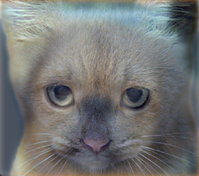|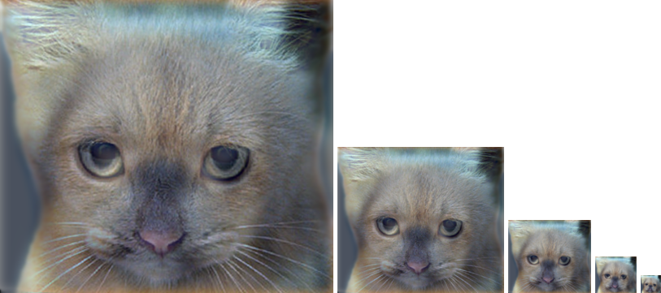|


* Bird & Plane

	|Low-frequency|High-frequency|Hybrid Image|With different scales|
	|---|---|---|---|
	||||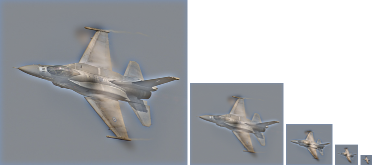|
	
	|Low-frequency|High-frequency|Hybrid Image|With different scales|
	|---|---|---|---|
	||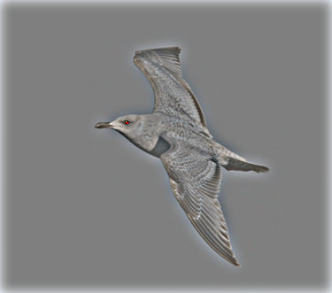|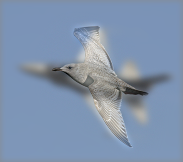||


* Fish & Submarine

	|Low-frequency|High-frequency|Hybrid Image|With different scales|
	|---|---|---|---|
	|||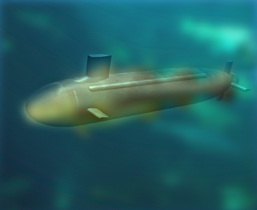|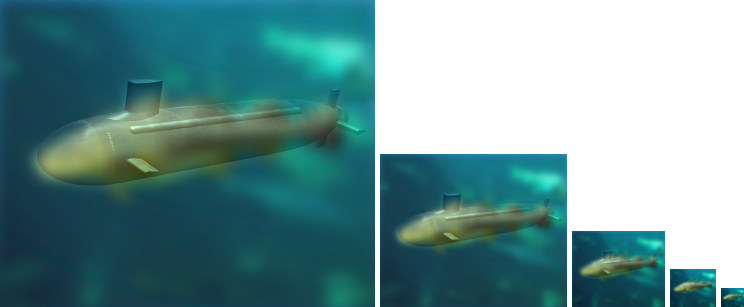|
	
	|Low-frequency|High-frequency|Hybrid Image|With different scales|
	|---|---|---|---|
	|||||


* Motorbicycle & Bicycle

	|Low-frequency|High-frequency|Hybrid Image|With different scales|
	|---|---|---|---|
	|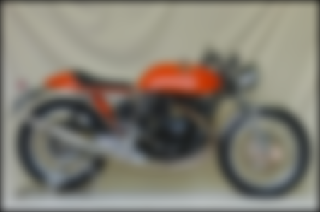||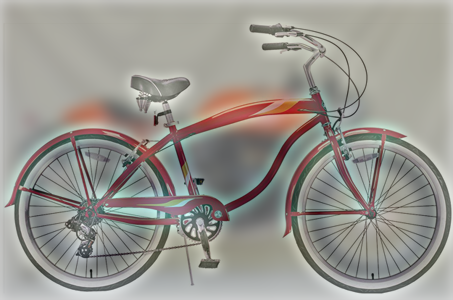|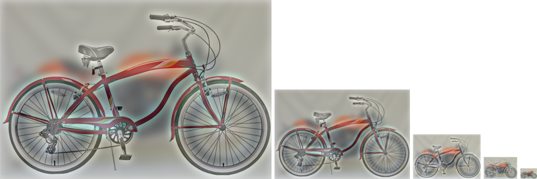|
	
	|Low-frequency|High-frequency|Hybrid Image|With different scales|
	|---|---|---|---|
	||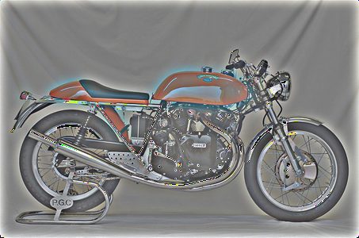|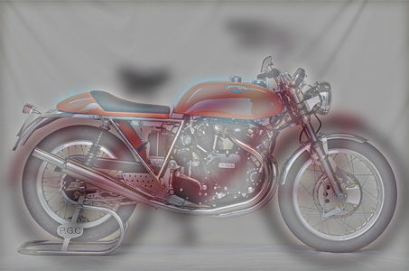||


* Einstein & Marilyn

	|Low-frequency|High-frequency|Hybrid Image|With different scales|
	|---|---|---|---|
	|||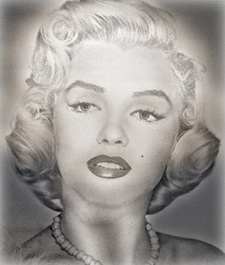||
	
	|Low-frequency|High-frequency|Hybrid Image|With different scales|
	|---|---|---|---|
	|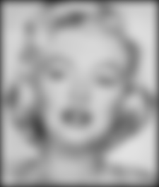|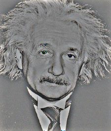|||

